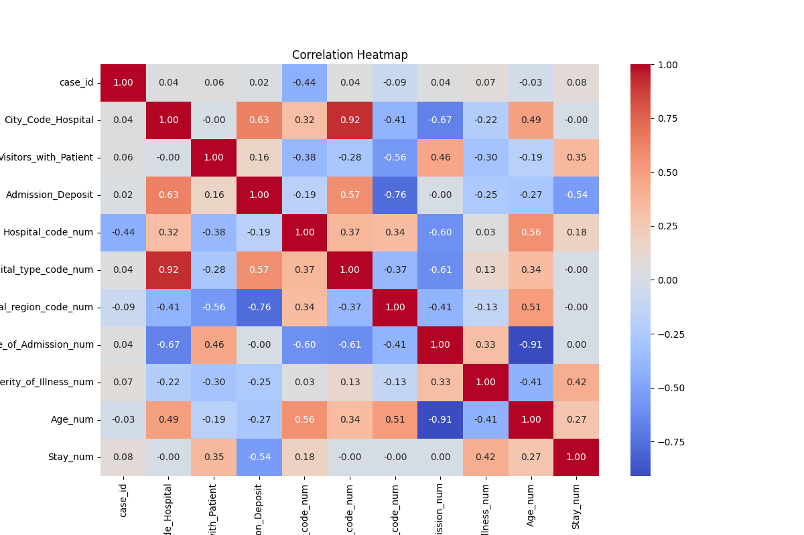
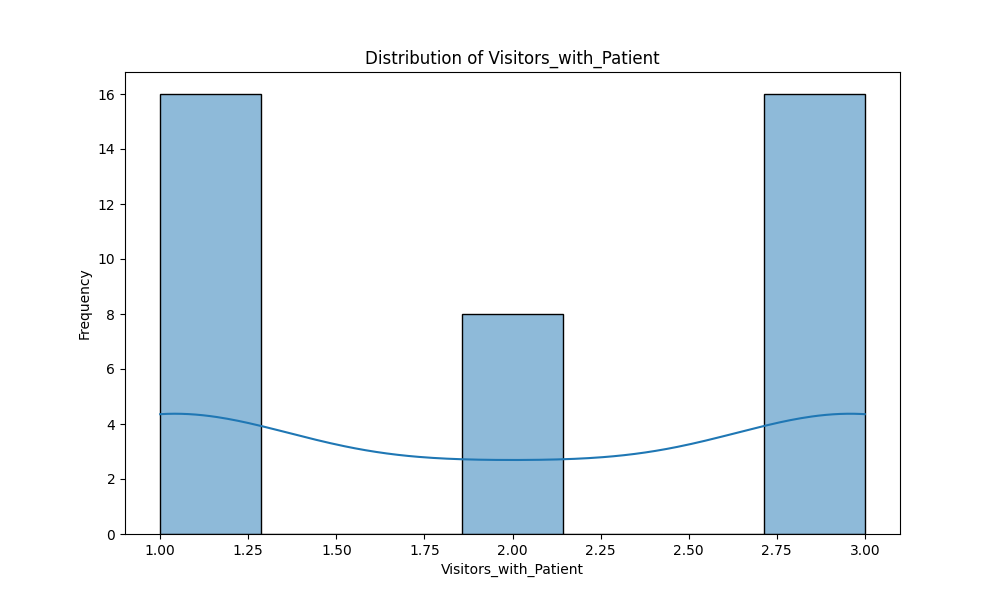

# Hospital Data Analysis Project

## Project Overview
This project demonstrates data analysis and visualization for hospital data. It includes:
- Connecting to a MySQL database.
- Fetching and inserting hospital records.
- Performing basic statistical analysis.
- Creating visualizations using Pandas, Matplotlib, and Seaborn.

This project is ideal for demonstrating **data handling, analysis, and visualization capabilities** using Python.

---

## Features
- Inserts sample hospital data into MySQL.
- Computes descriptive statistics (mean, min, max, std) and correlation matrices.
- Handles missing data and converts categorical variables for analysis.
- Generates visualizations such as histograms and heatmaps.
- Provides a clear structure for integrating Python with a database.

---

## Project Structure
The project contains the following files:

- `Hospital_Data_Anlysis_Main.py` : Main Python script performing database operations, analysis, and visualizations.
- `requirements.txt` : Lists Python dependencies required for the project.
- `hospital_data.csv` : Sample dataset (auto-generated for demonstration purposes).
- `README.md` : Project documentation.
- `LICENSE` : MIT License for open-source usage.
- `.gitignore` : Specifies files and folders to be ignored by Git.

---

## Installation
1. **Clone the repository** to your local machine:

```bash
git clone https://github.com/vaibhavchunekar/Hospital-Data-Analysis.git
cd Hospital-Data-Analysis
pip install -r requirements.txt
python Hospital_3.py

```

## Usage

- The script inserts sample data into the MySQL database.
- Displays descriptive statistics (mean, min, max, std) in the console.
- Shows correlation matrix.
- Generates visualizations such as histograms and heatmaps.

---

## Notes

- The included dataset is auto-generated; no sensitive data is used.
- Ensure MySQL server is running and the `hospital` database exists.
- Python 3.13+ is recommended.

## Output
Data inserted successfully.
c:\Users\chune\OneDrive\Desktop\Medical_Project\Python_Program\Hospital_3.py:23: UserWarning: pandas only supports SQLAlchemy connectable (engine/connection) or database string URI or sqlite3 DBAPI2 connection. Other DBAPI2 objects are not tested. Please consider using SQLAlchemy.
  data = pd.read_sql(query, connection)
Descriptive statistics:
          case_id  City_Code_Hospital  Visitors_with_Patient  Admission_Deposit
count  25.000000                25.0              25.000000          25.000000
mean   24.000000               102.2               2.000000       10954.600000
std     7.359801                 1.0               0.912871        5981.487642
min    12.000000               101.0               1.000000        5942.000000
25%    18.000000               101.0               1.000000        6257.000000
50%    24.000000               103.0               2.000000        6641.000000
75%    30.000000               103.0               3.000000       16017.000000
max    36.000000               103.0               3.000000       19916.000000

Missing data:
 case_id                   0
Hospital_code             0
Hospital_type_code        0
City_Code_Hospital        0
Hospital_region_code      0
Available_EXTRA_Room      0
Department               25
Ward_Type                25
Ward_Facility_Code       25
Bed_Grade                25
patientid                25
City_Code_Patient        25
Type_of_Admission         0
Severity_of_Illness       0
Visitors_with_Patient     0
Age                       0
Admission_Deposit         0
Stay                      0
dtype: int64

Correlation matrix:
                            case_id  City_Code_Hospital  Visitors_with_Patient  ...  Severity_of_Illness_num   Age_num      Stay_num
case_id                   1.000000        5.661385e-02           9.302605e-02  ...                 0.111187 -0.047565  1.315587e-01
City_Code_Hospital        0.056614        1.000000e+00          -1.089502e-15  ...                -0.218218  0.490098 -1.914639e-15
Visitors_with_Patient     0.093026       -1.089502e-15           1.000000e+00  ...                -0.298807 -0.191741  3.535534e-01
Admission_Deposit         0.033595        6.277145e-01           1.634136e-01  ...                -0.248371 -0.269996 -5.436260e-01
Hospital_code_num        -0.574340        2.886751e-01          -3.388155e-01  ...                 0.026997  0.502395  1.597191e-01
Hospital_type_code_num    0.069338        9.185587e-01          -2.795085e-01  ...                 0.133631  0.342997 -4.717682e-17
Hospital_region_code_num -0.138675       -4.082483e-01          -5.590170e-01  ...                -0.133631  0.514496  2.925695e-17
Type_of_Admission_num     0.056614       -6.666667e-01           4.564355e-01  ...                 0.327327 -0.910182  4.897080e-17
Severity_of_Illness_num   0.111187       -2.182179e-01          -2.988072e-01  ...                 1.000000 -0.412514  4.225771e-01
Age_num                  -0.047565        4.900980e-01          -1.917412e-01  ...                -0.412514  1.000000  2.711631e-01
Stay_num                  0.131559       -1.914639e-15           3.535534e-01  ...                 0.422577  0.271163  1.000000e+00


## Visualization

### Correlation Heatmap


### Admission Deposit Histogram


