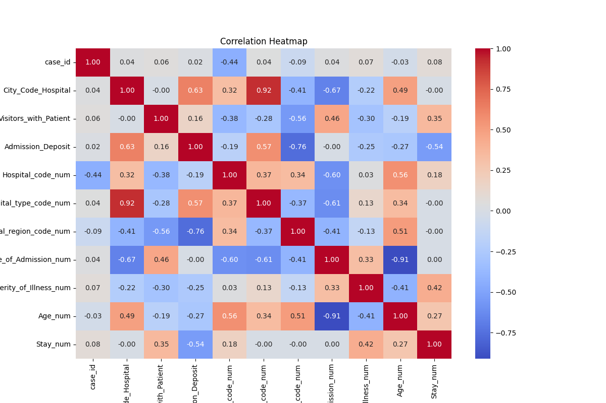
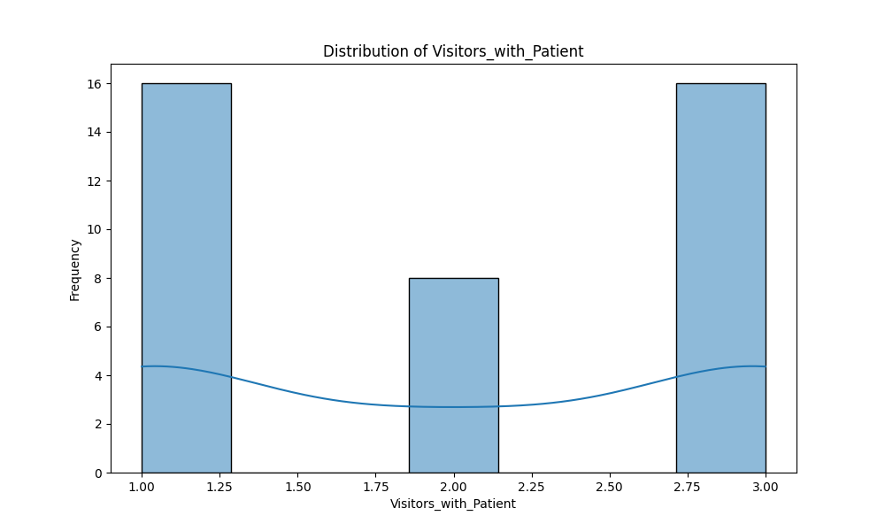

# Hospital Data Analysis Project

## Project Overview
This project demonstrates data analysis and visualization for hospital data. It includes:
- Connecting to a MySQL database.
- Fetching and inserting hospital records.
- Performing basic statistical analysis.
- Creating visualizations using Pandas, Matplotlib, and Seaborn.

This project is ideal for demonstrating **data handling, analysis, and visualization capabilities** using Python.

---

## Features
- Inserts sample hospital data into MySQL.
- Computes descriptive statistics (mean, min, max, std) and correlation matrices.
- Handles missing data and converts categorical variables for analysis.
- Generates visualizations such as histograms and heatmaps.
- Provides a clear structure for integrating Python with a database.

---

## Project Structure
The project contains the following files:

- `Hospital_3.py` : Main Python script performing database operations, analysis, and visualizations.
- `requirements.txt` : Lists Python dependencies required for the project.
- `hospital_data.csv` : Sample dataset (auto-generated for demonstration purposes).
- `README.md` : Project documentation.
- `LICENSE` : MIT License for open-source usage.
- `.gitignore` : Specifies files and folders to be ignored by Git.

---

## Installation
1. **Clone the repository** to your local machine:

```bash
git clone https://github.com/vaibhavchunekar/Hospital-Data-Analysis.git
cd Hospital-Data-Analysis
pip install -r requirements.txt
python Hospital_3.py

```

## Usage

- The script inserts sample data into the MySQL database.
- Displays descriptive statistics (mean, min, max, std) in the console.
- Shows correlation matrix.
- Generates visualizations such as histograms and heatmaps.

---

## Notes

- The included dataset is auto-generated; no sensitive data is used.
- Ensure MySQL server is running and the `hospital` database exists.
- Python 3.13+ is recommended.

## Sample Output

When running `Hospital_3.py`, the following results are generated:

### ✅ Console Messages

Data inserted successfully.

---

### 📊 Descriptive Statistics
| Metric | case_id | City_Code_Hospital | Visitors_with_Patient | Admission_Deposit |
|--------|---------|---------------------|------------------------|-------------------|
| Count  | 25      | 25                  | 25                     | 25                |
| Mean   | 24.00   | 102.2               | 2.0                    | 10954.6           |
| Std    | 7.36    | 1.0                 | 0.91                   | 5981.49           |
| Min    | 12      | 101                 | 1.0                    | 5942.0            |
| 25%    | 18      | 101                 | 1.0                    | 6257.0            |
| 50%    | 24      | 103                 | 2.0                    | 6641.0            |
| 75%    | 30      | 103                 | 3.0                    | 16017.0           |
| Max    | 36      | 103                 | 3.0                    | 19916.0           |

---

### 🔍 Missing Data

---

### 🔗 Correlation Matrix (Excerpt)
|                        | case_id | Visitors_with_Patient | Admission_Deposit |
|------------------------|---------|------------------------|-------------------|
| **case_id**            | 1.000   | 0.093                  | 0.034             |
| **Visitors_with_Patient** | 0.093   | 1.000                  | 0.163             |
| **Admission_Deposit**  | 0.034   | 0.163                  | 1.000             |

---


## Visualization

### Correlation Heatmap


### Admission Deposit Histogram


